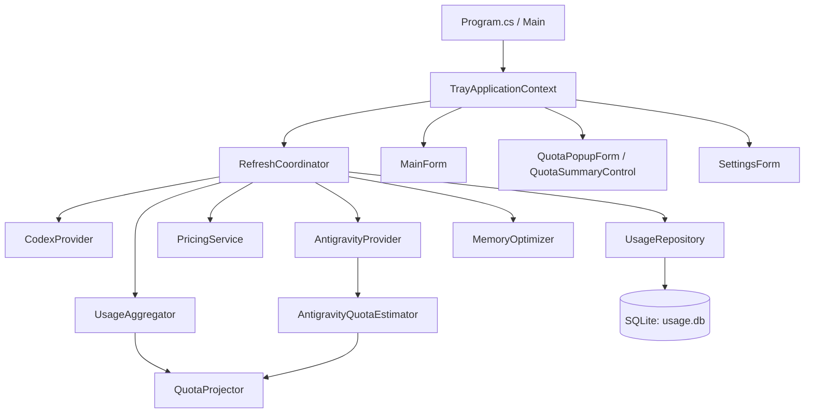
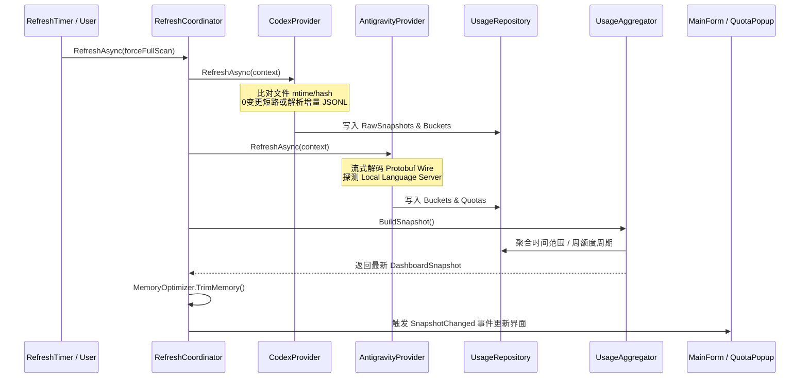

# CODE_INDEX: 系统代码总框架与模块索引

本文档是 QuotaTrace（Codex + Antigravity 本地用量与额度统计器）的代码全景导航与模块索引。在进行开发、调试或审查任务前，请先阅读本索引快速定位模块与链路，实际逻辑以最新源码为准。

---

## 1. 工程概览与解决方案结构

- **解决方案**: [`UsageTray.sln`](UsageTray.sln)
- **目标框架**: .NET 8.0 Windows (`net8.0-windows`)
- **交付目录**: [`publish/`](publish)

### 1.1 项目清单

| 项目 / 目录 | 输出类型 | 核心职责 |
| :--- | :--- | :--- |
| [`src/UsageTray/`](src/UsageTray) | WinExe (WinForms) | 主应用程序，包含托盘交互、高 DPI 界面、数据解析、SQLite 存储、计价引擎与调度。 |
| [`tests/UsageTray.Tests/`](tests/UsageTray.Tests) | Class Library (xUnit) | 单元与回归测试套件，涵盖计价、Protobuf 解码、会话归一化、额度周期预估、Codex 周历史重构、抖动聚合与提前重置防分裂、分模型独立测算、锚点切片用量防丢失、跨设备断层样本过滤、周历史集成及多语言/Provider 开关测试等 176 项测试。 |
| [`tools/AntigravityStatusRecorder/`](tools/AntigravityStatusRecorder) | Exe (Console) | 独立控制台工具，读取官方 status-line stdin JSON 并记录到本地存储。 |
| [`tools/CodexAudit/`](tools/CodexAudit) | Exe (Console) | 离线 Codex 审计与 CSV 导出工具。 |

---

## 2. 模块索引与源码路径

### 2.1 应用程序与生命周期 (`UsageTray.App`)

负责全局路径、配置持久化、国际化多语言管理、开机自启、单实例互斥以及维护 CLI 入口。

| 类名 | 路径 | 核心职责 |
| :--- | :--- | :--- |
| [`I18n`](src/UsageTray/App/I18n.cs) | `src/UsageTray/App/I18n.cs` | 全局轻量强类型国际化模块，支持自动检测（`auto`）与中英文切换（`zh-CN`/`en-US`），提供动态语言切换事件。 |
| [`AppPaths`](src/UsageTray/App/AppPaths.cs) | `src/UsageTray/App/AppPaths.cs` | 解析 `%LOCALAPPDATA%\UsageTray` 下的数据库、配置、价格与日志绝对路径。 |
| [`AppSettings`](src/UsageTray/App/AppSettings.cs) | `src/UsageTray/App/AppSettings.cs` | 定义用户配置模型及 JSON 读写，包含 `EnableCodex`/`EnableAntigravity`、语言设置、全量扫描周期与窗口尺寸/列宽记忆。 |
| [`SingleInstance`](src/UsageTray/App/SingleInstance.cs) | `src/UsageTray/App/SingleInstance.cs` | 基于系统互斥体（Mutex）确保进程单实例运行。 |
| [`StartupManager`](src/UsageTray/App/StartupManager.cs) | `src/UsageTray/App/StartupManager.cs` | 读写 Windows 注册表 `Run` 键，实现开机自启并提供标准交付产物路径规范化与自动修正同步机制。 |
| [`CodexMaintenanceCli`](src/UsageTray/App/CodexMaintenanceCli.cs) | `src/UsageTray/App/CodexMaintenanceCli.cs` | 命令行维护入口，支持数据库备份、全量重建与归一化诊断。 |

### 2.2 核心领域模型 (`UsageTray.Core`)

定义通用的基础数据结构、枚举、数据质量标识及计价规则。

| 类名 / 契约 | 路径 | 核心职责 |
| :--- | :--- | :--- |
| [`ProviderKind`](src/UsageTray/Core/ProviderKind.cs) | `src/UsageTray/Core/ProviderKind.cs` | 提供商枚举（`Codex`、`Antigravity`）及其存储转换。 |
| [`TokenUsage`](src/UsageTray/Core/TokenUsage.cs) | `src/UsageTray/Core/TokenUsage.cs` | 记录 Input、CacheRead、CacheWrite、Output、ThinkingOutput、长上下文等 Token 明细。 |
| [`UsageBucket`](src/UsageTray/Core/UsageBucket.cs) | `src/UsageTray/Core/UsageBucket.cs` | 聚合维度的核心用量桶（Provider/Model/Project/Date），承载 Token 统计与订阅参考金额计算。 |
| `CodexQuotaPools` | `src/UsageTray/Core/CodexQuotaPools.cs` | 集中识别标准、Spark/bengalfox、Reserve 模型池，供解析与周期查询复用。 |
| [`QuotaSnapshot`](src/UsageTray/Core/QuotaSnapshot.cs) | `src/UsageTray/Core/QuotaSnapshot.cs` | 配额快照模型，记录 5 小时与周配额比例、重置时间戳、过期状态（`IsResetPassed`）及快照陈旧标记（`IsStale`）；过期有效剩余比例为 null（`EffectiveRemainingFraction`）。 |
| [`TokenSpeedEstimate`](src/UsageTray/Core/TokenSpeedEstimate.cs) | `src/UsageTray/Core/TokenSpeedEstimate.cs` | 速率预估模型，记录未命中 Prefill、缓存读取与输出解码速度及样本数与格式化。 |

| [`PricingRule`](src/UsageTray/Core/PricingRule.cs) | `src/UsageTray/Core/PricingRule.cs` | 单个模型的定价规则定义（输入、缓存读、缓存写、输出单价、长上下文阶梯及核验日期）。 |
| [`DateRange`](src/UsageTray/Core/DateRange.cs) | `src/UsageTray/Core/DateRange.cs` | 时间范围区间（今天、7天、30天、本月、全部、本次周额度、自定义区间）。 |
| [`DataQuality`](src/UsageTray/Core/DataQuality.cs) | `src/UsageTray/Core/DataQuality.cs` | 数据质量与可信度标志（`Exact`、`PricingMissing`、`CacheWriteUnavailable` 等）。 |
| [`ProjectInfo`](src/UsageTray/Core/ProjectInfo.cs) | `src/UsageTray/Core/ProjectInfo.cs` | 项目标识与显示名称映射。 |

### 2.3 数据持久化与仓储 (`UsageTray.Data`)

管理本地 SQLite 数据库连接、表结构迁移、原始会话与聚合桶的 CRUD。

| 类名 | 路径 | 核心职责 |
| :--- | :--- | :--- |
| [`UsageDatabase`](src/UsageTray/Data/UsageDatabase.cs) | `src/UsageTray/Data/UsageDatabase.cs` | SQLite 连接工厂与连接池管理，配置 `PRAGMA cache_size = -2000` 限制内存。 |
| [`DatabaseMigrations`](src/UsageTray/Data/DatabaseMigrations.cs) | `src/UsageTray/Data/DatabaseMigrations.cs` | 数据库版本管理与 DDL 迁移（`sources`、`raw_snapshots`、`usage_buckets`、`quotas` 等表）。 |
| [`UsageRepository`](src/UsageTray/Data/UsageRepository.cs) | `src/UsageTray/Data/UsageRepository.cs` | 提供高效的批量写入、增量查询、按模型池与窗口复合键（`${ModelOrPoolId}_${WindowKind}`）获取标准/Spark/Reserve最新快照（含 Reserve 动态活跃触发检测）、各池 Token 窗口隔离及已删除源清理。 |

### 2.4 定价与抓取体系 (`UsageTray.Pricing`)

负责模型价格的匹配计算、长上下文阶梯判定、固定非促销参考基准内嵌、订阅倍率与安全迁移。

| 类名 | 路径 | 核心职责 |
| :--- | :--- | :--- |
| [`PricingService`](src/UsageTray/Pricing/PricingService.cs) | `src/UsageTray/Pricing/PricingService.cs` | 维护内存价格文档，提供通配符与别名精确匹配、模型阶梯加价计算与规则热升级。 |
| [`PricingMatcher`](src/UsageTray/Pricing/PricingMatcher.cs) | `src/UsageTray/Pricing/PricingMatcher.cs` | 模型名称规范化、别名映射与模式匹配引擎。 |
| [`PricingUpdateService`](src/UsageTray/Pricing/PricingUpdateService.cs) | `src/UsageTray/Pricing/PricingUpdateService.cs` | 合并软件内置参考基准，保留自定义规则；不抓取 API 促销价覆盖订阅参考。 |

### 2.5 数据提供商 (`UsageTray.Providers`)

负责从磁盘文件、数据库与本地服务中提取真实 Token、会话元数据与配额。

#### 2.5.1 Antigravity 提供商 (`UsageTray.Providers.Antigravity`)

| 类名 | 路径 | 核心职责 |
| :--- | :--- | :--- |
| [`AntigravityProvider`](src/UsageTray/Providers/Antigravity/AntigravityProvider.cs) | `src/UsageTray/Providers/Antigravity/AntigravityProvider.cs` | 统一驱动 Antigravity 历史解析、状态流记录、配额探测及已删除源清理。 |
| [`AntigravitySqliteHistoryParser`](src/UsageTray/Providers/Antigravity/AntigravitySqliteHistoryParser.cs) | `src/UsageTray/Providers/Antigravity/AntigravitySqliteHistoryParser.cs` | 从 `conversations/*.db` 读取 `gen_metadata` 与 `steps`，提取 Protobuf 结构化 Token 与时间戳。 |
| [`AntigravityProtobufReader`](src/UsageTray/Providers/Antigravity/AntigravityProtobufReader.cs) | `src/UsageTray/Providers/Antigravity/AntigravityProtobufReader.cs` | 基于 `ReadOnlySpan<byte>` 与 `ref struct` 的流式零分配 Protobuf Wire 解码器。 |
| [`AntigravityQuotaParser`](src/UsageTray/Providers/Antigravity/AntigravityQuotaParser.cs) | `src/UsageTray/Providers/Antigravity/AntigravityQuotaParser.cs` | 解析 `RetrieveUserQuotaSummary` 嵌套的 Protobuf/JSON 配额载荷。 |
| [`AntigravityLocalApi`](src/UsageTray/Providers/Antigravity/AntigravityLocalApi.cs) | `src/UsageTray/Providers/Antigravity/AntigravityLocalApi.cs` | 与 loopback 本地 language_server 通信，发送 CSRF Token 获取实时配额。 |
| [`AntigravityPortDiscovery`](src/UsageTray/Providers/Antigravity/AntigravityPortDiscovery.cs) | `src/UsageTray/Providers/Antigravity/AntigravityPortDiscovery.cs` | 基于进程 PID 毫秒级探测 language_server 动态绑定的 HTTP/HTTPS 端口。 |
| [`AntigravityQuotaEstimator`](src/UsageTray/Providers/Antigravity/AntigravityQuotaEstimator.cs) | `src/UsageTray/Providers/Antigravity/AntigravityQuotaEstimator.cs` | 按 Gemini 与 Claude 双模型池独立周期聚合 Token，推算周本轮金额与满额订阅参考价值。 |
| [`AntigravityProjectResolver`](src/UsageTray/Providers/Antigravity/AntigravityProjectResolver.cs) | `src/UsageTray/Providers/Antigravity/AntigravityProjectResolver.cs` | 从 summary 数据库与 trajectory blob 中解析项目物理根路径。 |
| [`AntigravityStatusRecorder`](src/UsageTray/Providers/Antigravity/AntigravityStatusRecorder.cs) | `src/UsageTray/Providers/Antigravity/AntigravityStatusRecorder.cs` | 官方 status-line stdin 增量处理器。 |

#### 2.5.2 Codex 提供商 (`UsageTray.Providers.Codex`)

| 类名 | 路径 | 核心职责 |
| :--- | :--- | :--- |
| [`CodexProvider`](src/UsageTray/Providers/Codex/CodexProvider.cs) | `src/UsageTray/Providers/Codex/CodexProvider.cs` | 管理 Codex 会话文件扫描、0 变更短路检查、增量/全量解析及快照归一化。 |
| [`CodexJsonlParser`](src/UsageTray/Providers/Codex/CodexJsonlParser.cs) | `src/UsageTray/Providers/Codex/CodexJsonlParser.cs` | 逐行容错解析 session JSONL（ParserVersion 12），过滤新版 CLI 调试级 `token_usage_record`，绑定权威 `token_count`，独立提取并解耦 Spark 辅助模型配额池（`codex-spark-5h` 与 `codex-spark-weekly`）与主力通用额度（`codex-weekly`）；采用变动增量采集与去重保留单文件内完整的时序配额快照，彻底杜绝单文件末行覆盖导致中间快照丢失。 |
| [`CodexUsageNormalizer`](src/UsageTray/Providers/Codex/CodexUsageNormalizer.cs) | `src/UsageTray/Providers/Codex/CodexUsageNormalizer.cs` | 跨文件多分支会话归一化引擎，处理全局累计计数器差分、时间倒序重排与回退 Epoch。 |
| [`CodexSessionLocator`](src/UsageTray/Providers/Codex/CodexSessionLocator.cs) | `src/UsageTray/Providers/Codex/CodexSessionLocator.cs` | 发现 `CODEX_HOME` 及默认 `~/.codex/sessions` 下的活动与归档会话文件。 |

### 2.6 服务层与聚合调度 (`UsageTray.Services`)

| 类名 | 路径 | 核心职责 |
| :--- | :--- | :--- |
| [`RefreshCoordinator`](src/UsageTray/Services/RefreshCoordinator.cs) | `src/UsageTray/Services/RefreshCoordinator.cs` | 刷新主调度器，协调并发锁、增量/全量扫描、价格更新与快照广播。 |
| `QuotaProjector` | `src/UsageTray/Services/QuotaProjection.cs` | Codex/Antigravity 共用的同周期快照差分外推（快照陈旧时平滑保留金额并标记“快照待更新”）；并提供 `EstimateModelProjections` 基于额度变动锚点驱动的微区间切片归因与多模型测算算法（防止中间快照额度未变导致 Token 漏计，识别主导模型、差分外推各模型周满额价值与历史同套餐回溯兜底）。 |
| [`UsageAggregator`](src/UsageTray/Services/UsageAggregator.cs) | `src/UsageTray/Services/UsageAggregator.cs` | 聚合引擎，按日期区间/双额度周周期汇总 Token、计算订阅参考金额及缓存命中率；将主力通用模型与 Spark 辅助模型彻底双通道解耦聚合，并结合 Reserve 活跃触发状态动态支持最多三通道周周期与满额推算；构建周历史周期时按 `ResetAt` 12 小时容差聚类消除并发会话交替导致的虚假分裂，并建立 100% 完整额度周期基准；调度主力池分模型测算并分发至视图模型；为历史周周期切片计算独立分模型测算并在当前周期不足 5% 时平滑继承。 |
| [`UsageViews`](src/UsageTray/Services/UsageViews.cs) | `src/UsageTray/Services/UsageViews.cs` | 视图数据模型，包含 `DashboardSnapshot`（支持分池订阅参考金额、双周周期列表 `CodexWeeklyCycles` 与分模型周满额测算 `CodexModelProjections`）、`ModelUsageView`（携带单模型推算周满额）、`ModelQuotaProjectionView` 及 `CodexHistoricalCycleView`（包含 `ModelProjections` 分模型测算列表、100% 周期额度基准与全周期消耗比例）等。 |
| [`MemoryOptimizer`](src/UsageTray/Services/MemoryOptimizer.cs) | `src/UsageTray/Services/MemoryOptimizer.cs` | 执行 LOH 压缩、GC 及 Windows 原生 `SetProcessWorkingSetSize` 深度回收常驻内存。 |
| [`DiagnosticsService`](src/UsageTray/Services/DiagnosticsService.cs) | `src/UsageTray/Services/DiagnosticsService.cs` | 输出提供商状态、数据库统计与解析诊断报告。 |
| [`ProjectService`](src/UsageTray/Services/ProjectService.cs) | `src/UsageTray/Services/ProjectService.cs` | 项目名称别名与路径美化服务。 |

### 2.7 用户界面与交互控件 (`UsageTray.UI`)

采用自适应高 DPI 设计、自绘渲染及几何/矢量高清图标。

| 类名 / 控件 | 路径 | 核心职责 |
| :--- | :--- | :--- |
| [`TrayApplicationContext`](src/UsageTray/UI/TrayApplicationContext.cs) | `src/UsageTray/UI/TrayApplicationContext.cs` | 托盘主上下文，管理托盘图标、右键菜单、单击/双击防冲突计时器及定时刷新。 |
| [`MainForm`](src/UsageTray/UI/MainForm.cs) | `src/UsageTray/UI/MainForm.cs` | 主仪表盘窗口，展示多通道订阅参考金额卡片、趋势图表、模型表（含各模型「推算周满额」列与悬浮说明 Tooltip）、项目表及额度面板；采用异步独立加载（Task.Run）、请求序列防竞态与 DataGridView 双缓冲，实现秒级响应与零卡顿。 |
| [`QuotaPopupForm`](src/UsageTray/UI/QuotaPopupForm.cs) | `src/UsageTray/UI/QuotaPopupForm.cs` | 单击托盘弹出的高清额度摘要窗口，直接宿主承载 `QuotaSummaryControl` 保证与主窗口 100% 同源同布，支持拖拽移动锁定、主动点击/Esc 关闭、失焦防误关及工作区限高滚动。 |
| [`QuotaSummaryControl`](src/UsageTray/UI/Controls/QuotaSummaryControl.cs) | `src/UsageTray/UI/Controls/QuotaSummaryControl.cs` | 复用的额度摘要自绘控件（主窗口额度 Tab 与悬浮窗共用；主窗口额度 Tab 下在主力池满额预估后额外展开各模型独立测算分支树；快照陈旧时平滑显示测算金额并标记“（待更新）”）。 |
| [`CodexHistoryControl`](src/UsageTray/UI/Controls/CodexHistoryControl.cs) | `src/UsageTray/UI/Controls/CodexHistoryControl.cs` | 独立的 Codex 周历史主面板页面控件，展示过去数次区间的周额度（非固定 7 天动态判定、进行中/已重置状态高亮、标准 100% 基准额度变化 `100% → {minRem:P0}`、订阅参考金额、满额预估、第 9 列「模型独立测算」及 4 行底部明细面板）。 |
| [`DailyBarChartControl`](src/UsageTray/UI/Controls/DailyBarChartControl.cs) | `src/UsageTray/UI/Controls/DailyBarChartControl.cs` | 自绘每日用量柱状图，支持动态 DPI 刻度与图例排版。 |
| [`SettingsForm`](src/UsageTray/UI/SettingsForm.cs) | `src/UsageTray/UI/SettingsForm.cs` | 可缩放的设置窗口，包含刷新间隔、每周全量扫描开关、价格更新与维护入口。 |
| [`PricingViewerForm`](src/UsageTray/UI/PricingViewerForm.cs) | `src/UsageTray/UI/PricingViewerForm.cs` | 独立模型价格查看窗口，支持按提供商筛选与实时搜索。 |
| [`DateRangeDialog`](src/UsageTray/UI/DateRangeDialog.cs) | `src/UsageTray/UI/DateRangeDialog.cs` | 自定义起止日期选择对话框。 |
| [`QuotaDisplayFormatter`](src/UsageTray/UI/QuotaDisplayFormatter.cs) | `src/UsageTray/UI/QuotaDisplayFormatter.cs` | 托盘紧凑单行 Tooltip 格式化工具，解耦主力模型周额度与 Spark 额度并列呈现。 |
| [`TimeFormatter`](src/UsageTray/UI/TimeFormatter.cs) | `src/UsageTray/UI/TimeFormatter.cs` | 时间与重置倒计时格式化工具，生成“X天X小时X分后”相对时间。 |
| [`AppIcon`](src/UsageTray/UI/AppIcon.cs) | `src/UsageTray/UI/AppIcon.cs` | 内嵌资源高清图标加载器及几何矢量兜底绘制。 |
| [`WindowGeometryPersistence`](src/UsageTray/UI/WindowGeometryPersistence.cs) | `src/UsageTray/UI/WindowGeometryPersistence.cs` | 窗口尺寸与主页各表格栏位宽度自动持久化与恢复。 |

---

## 3. 关键调用链与数据流

### 3.1 增量与全量刷新数据流

### 3.2 订阅参考金额计算公式

- **Sub2API 三段式输入口径**:
  $$\text{未命中输入 (Input)} = \text{TotalInput} - \text{CacheRead} - \text{CacheWrite}$$
- **基础计费公式**:
  $$\text{Cost} = (\text{Input} \times P_{in} + \text{CacheRead} \times P_{cr} + \text{CacheWrite} \times P_{cw} + \text{Output} \times P_{out}) / 10^6$$
- **长上下文阶梯判定**:
  单次 Request 命中阈值（如 Gemini Pro > 200K Tokens，GPT-6 / GPT-5.6 > 272K Tokens）时，按长上下文独立单价结算。
- **满额预估价值推算**:
  $$\text{EstimatedFullUsd} = \frac{\text{两次快照间本机参考金额}}{\text{初始剩余比例} - \text{末次剩余比例}}$$

---

## 4. 维护与扩展准则

1. **新增模型价格**: 修改 [`Pricing/default-pricing.json`](src/UsageTray/Pricing/default-pricing.json) 并升级 `PricingService.DefaultDocumentVersion`。
2. **数据库结构变更**: 在 [`DatabaseMigrations.cs`](src/UsageTray/Data/DatabaseMigrations.cs) 增加递增迁移脚本，切勿直接修改历史迁移步骤。
3. **解析器升级**: 若修改了 Token 提取算法，递增对应 Provider 的 `ParserVersion`，使系统自动清理旧缓存并触发一次全量重新计算。
4. **测试覆盖**: 任何涉及数据解析、计价或周窗口计算的代码修改，必须在 [`tests/UsageTray.Tests`](tests/UsageTray.Tests) 补充对应的单元测试。
