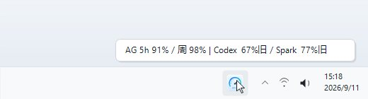
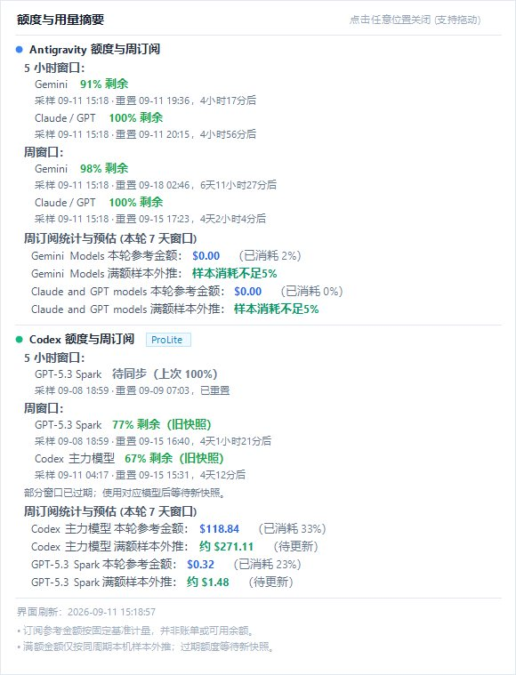
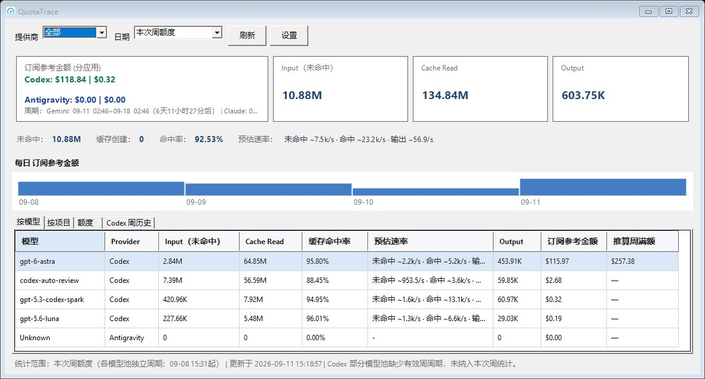

<div align="center">

# 📊 QuotaTrace
### (AI Usage & Quota Monitor)

一款专为 **Windows** 桌面端打造的 **OpenAI Codex** 与 **Google Antigravity** 本地轻量用量监控与额度测算小助手。

<div>
    
    
    
    
</div>

<br>

[简体中文](README.md) | [English](README_en.md)

<br>

**专为 Windows 打造 · 零外网出站请求 · 零隐私上传 · 毫秒级增量 · 纯本机解析与进程通信**

---
</div>

> **💡 原理极简介绍**：本工具直接离线读取本机 CLI 会话日志文件（`*.jsonl`）与本地后台环回端口（`127.0.0.1`），毫秒级提取真实 Token 消耗、模型耗时与官方额度快照——**QuotaTrace 自身绝不发起任何外网出站请求（No outbound requests from QuotaTrace）、无第三方中转、无任何隐私遥测**。

<br>

## 📖 使用说明

QuotaTrace 专为 Windows 桌面打造，常驻在任务栏右下角系统托盘中，提供三种渐进式的交互形态：

### 1. 托盘悬浮提示 (Tray Tooltip)
- **如何开启**：将鼠标悬停在 Windows 任务栏右下角托盘图标上（常驻无感）。
- **主要功能**：
  - **极简无感**：以原生轻量 Tooltip 气泡浮现，不抢焦点、不遮挡当前工作区，余光一扫即知剩余额度；
  - **核心指标并列**：单行聚合 Antigravity 与 Codex 的 5 小时及周额度百分比（如 `AG 5h 93% / 周 49% | Codex 5h 100% / 周 79%`）；
  - **自动同步**：后台每次轮询或增量同步后，悬浮文字毫秒级自动更新。

<div align="center">
  
</div>

### 2. 单击小面板 (Tray Mini Popup)
- **如何开启**：鼠标左键单击 Windows 右下角托盘图标（单击即出，失焦或再次点击自动收起）。
- **主要功能**：
  - **即用即走**：轻量卡片瞬间弹出，直观展示 Codex 与 Antigravity 各模型池的额度进度条与精准倒计时；
  - **周消耗与满额测算**：清晰展示本轮 7 天窗口内的实际 API 消耗金额与推算满额订阅价值；
  - **一键常驻悬浮**：鼠标直接按住此卡片拖动，即可原地锁定为桌面常驻悬浮窗（亦可在托盘右键菜单勾选【固定显示额度摘要】）。

<div align="center">
  
</div>

### 3. 主面板 / 仪表盘 (Main Dashboard)
- **如何开启**：鼠标左键双击托盘图标，或在托盘右键菜单点击【打开仪表盘】。
- **主要功能**：
  - **全景额度与消耗大盘**：直观查看过去 7 天 / 30 天或自定义周期的 Token 消耗柱状图与 API 计价走势；
  - **分模型额度测算（核心功能）**：查看基于本机实测切片推算的各模型周满额等值（如纯 Sol 满额 vs 纯 Astra 满额），精准核算订阅真实价值与每个模型的消耗占比；
  - **KV Cache 缓存命中深度分析**：从【按模型】与【按工程项目（Project）】双维度深入对比未命中输入、缓存读取、缓存创建与实时缓存命中率（%），指导优化提示词上下文；
  - **会话与周期切片明细**：深入审查每次额度扣减切片中对应的具体模型、Token 构成及单次请求吞吐速率；
  - **偏好与系统设置**：一键切换中/英文界面语言、独立启用或禁用 Codex / Antigravity、配置自动刷新间隔与开机自启。

<div align="center">
  
</div>

---

## 📥 下载与安装

### 方式一：下载免安装绿色版（推荐普通用户）
无需配置编译环境或安装 .NET SDK，开箱即用：
1. 前往本仓库右侧的 **[Releases 页面](../../releases)**；
2. 下载最新版本的发布压缩包（例如 `QuotaTrace-v1.0.0-win-x64.zip`）；
3. 解压到本地任意文件夹，双击运行 **`UsageTray.exe`** 即可。
> 绿色安全：软件配置与解析数据库均保存在本地 `%LOCALAPPDATA%\UsageTray\` 中，卸载时直接删除解压目录即可，无注册表残留。

### 方式二：从源码编译运行（开发者）
适合希望自行修改或调试代码的开发者：
- **环境要求**：Windows 10 / 11 (x64)，已安装 [.NET 8.0 SDK](https://dotnet.microsoft.com/download/dotnet/8.0)。

```powershell
# 1. 克隆代码仓库
git clone https://github.com/your-username/QuotaTrace.git
cd QuotaTrace

# 2. 还原依赖并运行自动化单元测试
dotnet restore
dotnet test

# 3. 本地启动运行
dotnet run --project src/UsageTray/UsageTray.csproj

# 4. 打包本地 Release 免安装程序
dotnet publish -c Release
```
打包生成的可执行文件与运行依赖将输出在 `publish/` 目录下。

---

## ✨ 亮点功能与技术原理

### 🎯 额度测算与满额样本外推（核心功能）
- **满额等值预估**：根据本轮周期实际消耗的 Token 比例与官方额度下降百分比，线性外推当前周期的总额度等值（USD）。
- **为什么 Codex 需要按不同模型分别推算？** 
  在 OpenAI Codex 的官方周额度扣减机制中，不同模型扣除额度的速度与公有云 API 费率并不一致（例如 `gpt-6-astra` 扣额度明显更快，纯用 Astra 和纯用 `gpt-5.6-sol` 的整周满额折算金额相差约 1.8 倍）。
  如果简单把所有模型混在一起算，算出来的周总额就会因为某天多用了哪个模型而忽高忽低。因此本工具会根据每次额度下降时具体是由哪个模型调用的，分别拆开统计，单独推算出『如果整周全用该模型能用多少钱』（例如：纯 Astra 跑满一周约多少钱 vs 纯 Sol 跑满一周约多少钱），不再受混用影响。

### ⚡ 缓存命中与 Prompt 优化分析（便捷功能）
- 精确细分未命中输入（Uncached Input）、缓存读取（Cache Read）、缓存创建（Cache Creation）与输出 Token。
- 自动计算实时**缓存命中率（Cache Hit Rate %）**，支持从【按模型】和【按项目（Project）】两个维度对比各工程的 KV Cache 命中效率，帮助优化 Prompt 结构、节约开销并加快首字响应。

### 🔄 双 Provider 独立支持与自由开关
- 同时支持 **Codex** 与 **Antigravity** 监控，也可在设置中单独关闭任意一方（如仅使用 Codex 或仅使用 Antigravity）。
- 界面自适应折叠：未启用的工具自动隐藏对应卡片与 Codex 周历史 Tab，后台彻底跳过对应扫描，极致省电省内存。

### 📊 实时 Quota 状态与重置倒计时
- 精准展示 5 小时窗口与周额度剩余百分比、采样时间及绝对/相对重置时间（如 `3天2小时后`）。
- 悬浮即显卡片式弹窗，托盘图标支持紧凑文本概览。

---

## ⚡ 性能与运行机制说明

> [!TIP]
> - **首次使用**：软件初次启动需要对本地所有历史会话进行一次全量扫描与索引构建。若积累的历史会话较多（如数万条记录），首次加载可能需要数秒至十几秒，请稍作等待；
> - **日常运行**：初次之后软件只会进行毫秒级增量比对（仅扫描发生新改动的文件），CPU 占用近乎为零，常驻物理内存经深度优化后稳定在 15MB~30MB 左右，极度轻量无感。

---

## 🔒 隐私与数据安全

- **出站安全**：QuotaTrace 自身 100% 零外网出站请求（No outbound requests）。仅离线扫描本地用户目录中的 sessions 增量日志与本地 `127.0.0.1` 环回端口读取内存快照，绝不向外部网络发送任何数据。
- **正文零留存**：绝不记录 Prompt、Response、代码上下文、工具输出或认证 Token。
- **本地存储**：数据仅保存在本机 `%LOCALAPPDATA%\UsageTray\usage.db`。

---

## 📄 开源协议 (License)

本项目基于 [MIT License](LICENSE) 协议开源。
