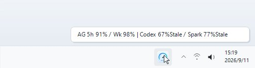
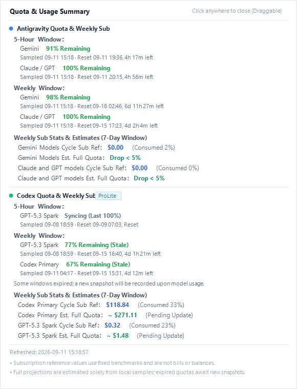
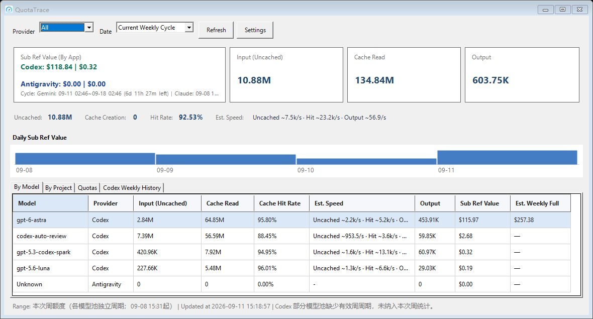

<div align="center">

# 📊 QuotaTrace
### (AI Usage & Quota Monitor)

A lightweight, 100% local Windows system tray utility for developers using **OpenAI Codex** and **Google Antigravity**.

<div>
    
    
    
    
</div>

<br>

[简体中文](README.md) | [English](README_en.md)

<br>

**No Outbound Requests · Zero Cloud Upload · Zero Telemetry · 100% Local Loopback IPC**

---
</div>

> **💡 How it Works (Briefly)**: QuotaTrace parses local CLI session files (`*.jsonl`) offline and queries local loopback status ports (`127.0.0.1`) directly on your machine. It extracts real token consumption, latency, and official quota snapshots with **strictly no outbound requests from QuotaTrace, zero telemetry, and zero cloud logins**.

<br>

## 📖 How to Use

QuotaTrace provides three progressive interaction modes, from glanceable ambient monitoring to deep multi-dimensional analytics:

```
┌─────────────────────────────────────────────────────────┐
│                   System Tray Resident                  │
└────────────┬────────────────────────────┬───────────────┘
             │ Hover Cursor               │ Single Click
             ▼                            ▼
┌─────────────────────────┐  ┌────────────────────────────┐
│ 1. Tray Tooltip         │  │ 2. Tray Popup Card         │
└────────────┬────────────┘  └────────────┬───────────────┘
             │                            │ Double Click
             └─────────────┬──────────────┘
                           ▼
             ┌────────────────────────────┐
             │ 3. Main Dashboard          │
             └────────────────────────────┘
```

### 1. Tray Tooltip (Hover Glance)
- **How to Trigger**: Hover your mouse cursor over the system tray icon in the Windows taskbar (no clicking required).
- **Key Features**:
  - **Zero Interruption**: Lightweight native tooltip balloon appearing instantaneously without stealing focus or obscuring your work;
  - **Key Metrics Side-by-Side**: Compact single-line summary of 5-hour and weekly quota percentages for both Antigravity and Codex (e.g., `AG 5h 93% / Wk 49% | Codex 5h 100% / Wk 79%`);
  - **Always Current**: Automatically refreshed in milliseconds on background polling or incremental sync.

<div align="center">
  
</div>

### 2. Tray Mini Popup (Single-Click Card)
- **How to Open**: Single left-click the system tray icon (instant popover; automatically dismisses on focus loss or second click).
- **Key Features**:
  - **Non-Intrusive**: Elegant card displaying progress bars, reset timestamps, and countdowns for all model pools across both providers;
  - **Weekly Cost & Projections**: Clear view of actual API usage costs in the current 7-day window and projected full-quota subscription value;
  - **Drag to Pin**: Click and drag the card anywhere on your desktop to lock it as an always-on-top floating HUD (or check **Pin Quota Summary** in the tray menu).

<div align="center">
  
</div>

### 3. Main Dashboard
- **How to Open**: Double-click the system tray icon, or right-click and select **Open Dashboard**.
- **Key Features**:
  - **Comprehensive Usage Overview**: Visual daily bar charts and API pricing equivalents for the past 7 days, 30 days, or custom date ranges;
  - **Per-Model Quota Valuation (Core Feature)**: Projects full-week quota equivalents in USD for each model based on real local drop slices (e.g., full Astra equivalent vs. full Sol equivalent);
  - **Prompt Cache Hit Rate Analytics**: Multi-dimensional breakdown of Uncached Input, Cache Read, Cache Creation, and live Cache Hit Rate (%) across both **Models** and physical **Projects**;
  - **Session & Slice Auditing**: Detailed inspection of individual quota drop intervals, timestamped model usages, and request throughput rates;
  - **Settings & Preferences**: Switch between English and Simplified Chinese, independently toggle Codex or Antigravity monitoring, customize refresh frequency, and toggle auto-start with Windows.

<div align="center">
  
</div>

---

## 📥 Download & Installation

### Option 1: Download Standalone Release (Recommended for Most Users)
No need to install the .NET SDK or configure build environments:
1. Head to the **[Releases Page](../../releases)** on the right side of this repository;
2. Download the latest release zip archive (e.g., `QuotaTrace-v1.0.0-win-x64.zip`);
3. Extract it to any local directory and double-click **`UsageTray.exe`** to run.
> 100% Portable: App settings and local usage databases are stored cleanly under `%LOCALAPPDATA%\UsageTray\`. To uninstall, simply delete the extracted folder.

### Option 2: Build & Run from Source (For Developers)
For developers wishing to inspect or customize the source code:
- **Prerequisites**: Windows 10 / 11 (x64) with [.NET 8.0 SDK](https://dotnet.microsoft.com/download/dotnet/8.0) installed.

```powershell
# 1. Clone the repository
git clone https://github.com/your-username/QuotaTrace.git
cd QuotaTrace

# 2. Restore dependencies and run unit tests
dotnet restore
dotnet test

# 3. Launch locally
dotnet run --project src/UsageTray/UsageTray.csproj

# 4. Publish release executable
dotnet publish -c Release
```
The compiled binaries will be generated under the `publish/` directory.

---

## ✨ Key Features & Technical Principles

### 🎯 Sample-Based Quota Value Projection & Per-Model Estimation (Core Feature)
- **Full Quota Projection**: Extrapolates estimated full-cycle quota values (in USD) by dividing observed local API cost by the observed official quota drop percentage.
- **Why per-model projection for Codex?**
  In OpenAI Codex subscriptions, different models deplete quotas at rates disproportionate to their standard public API pricing (for example, `gpt-6-astra` depletes quota significantly faster than `gpt-5.6-sol`, with full-week dollar estimates differing by roughly 1.8x).
  If all models were blended together, the weekly dollar total would fluctuate drastically depending on which model was used that day. Instead, QuotaTrace segments usage by micro-interval slices during each quota drop, projecting independent full-week estimates for each model (e.g. "What if you used 100% Astra this week?" vs. "What if you used 100% Sol?"), eliminating cross-model distortion.

### ⚡ Prompt Cache Hit Rate Analytics by Model & Project (Convenience Feature)
- Precisely decomposes token consumption into Uncached Input, Cache Read, Cache Creation, and Output tokens.
- Calculates live **Cache Hit Rate (%)** and enables side-by-side KV Cache efficiency comparisons across both **Models** and physical **Projects** to optimize prompt structure and speed.

### 🔄 Dual Provider Support with Independent Toggles
- Simultaneously monitors **Codex** and **Antigravity**, or allows you to disable either in Settings if you only use one tool.
- Adaptive UI: Inactive providers automatically collapse their cards and hide associated tabs, and the background scanner completely skips inactive paths to minimize resource usage.

### 📊 Real-Time Quota Snapshots & Reset Countdowns
- Displays remaining percentages, capture timestamps, and relative/absolute reset countdowns for 5-hour and weekly windows.
- Accessible via floating HUD, tray popup, or compact tray icon tooltip.

---

## ⚡ Performance & Lifecycle Notes

> [!TIP]
> - **First Launch**: The software performs an initial full scan across historical CLI sessions to build SQLite indexes. If you have months of heavy history, this initial scan may take several seconds.
> - **Daily Runs**: Subsequent launches and regular refreshes use millisecond-level incremental checks (scanning only newly modified files). CPU usage is virtually 0%, and memory usage is trimmed down to ~15MB–30MB.

---

## 🔒 Privacy & Data Security

- **Outbound Security**: QuotaTrace makes 100% zero outbound requests. It only scans local session logs offline and queries local loopback (`127.0.0.1`) ports for in-memory status snapshots.
- **Zero Content Retention**: Never inspects, extracts, or stores prompts, model responses, code context, tool parameters, or authentication credentials.
- **Local Storage Only**: All aggregated metrics remain strictly on your machine at `%LOCALAPPDATA%\UsageTray\usage.db`.

---

## 📄 License

This project is licensed under the [MIT License](LICENSE).
